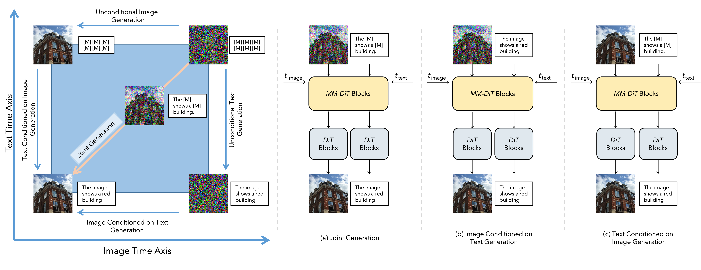
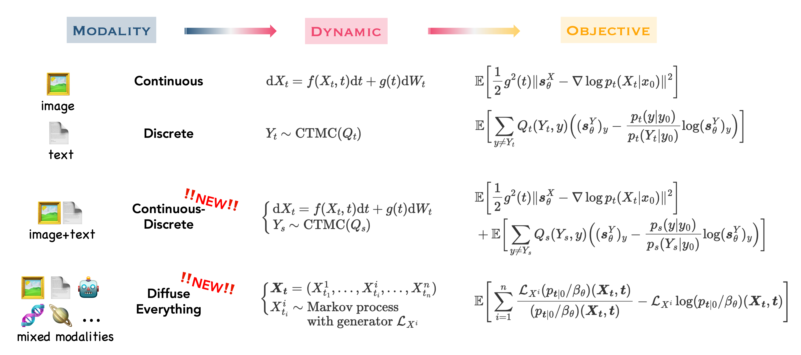
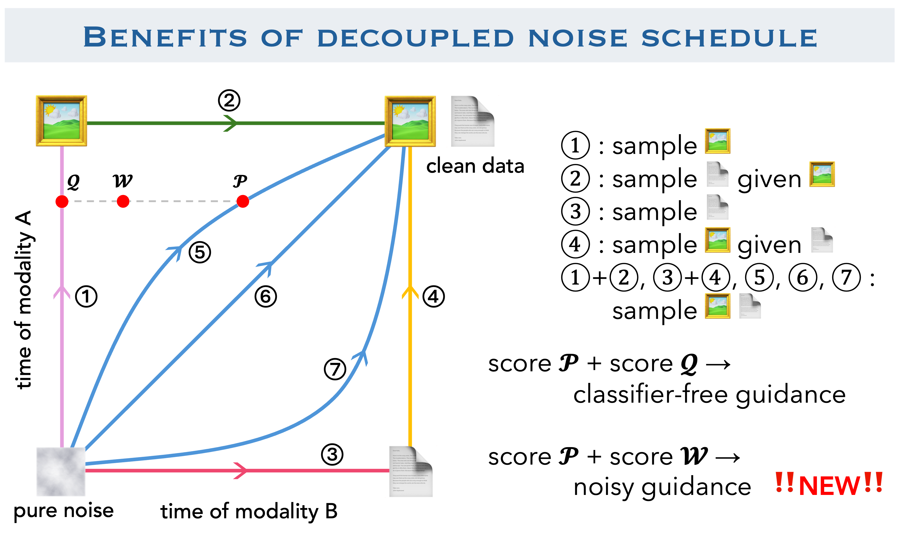

# Diffuse Everything: Multimodal Diffusion Models on Arbitrary State Spaces

[](https://arxiv.org/abs/2506.07903)
[](LICENSE)
[](https://x.com/YuchenZhu_ZYC/status/1934700344707363180)


Welcome to the official repository for **Diffuse Everything** (accepted at ICML 2025), for  <span style="color:#A020F0">**mixed-type tabular data synthesis**</span>. For text-image joint generation, please see [Diffuse-Everything](https://github.com/KevinRojas1499/Diffuse-Everything).



## Introduction
**Diffuse Everything** is a general framework for building multimodal diffusion models for data of mixed modality, with a minimum need for tokenizers/VAEs/extra encoders. 

**Diffuse Everything** is built on <span style="color:orange">denoising markov models</span>, a generalized notion of denoising diffusion that characterizes the process using notions of Markov processes and their generators. This enables us to derive training objectives with theoretical guarantees in a general and modular fashion.



Specifically, in **Diffuse Everything**, we allow the diffusion process on each state space to have a <span style="color:orange">decoupled, independent schedule </span>, allowing modalities to be noised at their own pace. This enables the following benefits:
- Enjoying any-to-any within a single model
- A new guidance mechanism for multimodal generation




## Latest Update

[Jun 23, 2025] We have open sourced the code.

[May 01, 2025] Diffuse Everything was accepted to ICML 2025.


## Citation
If you find our work and repo help, we would appreciate your citations :smiling_face_with_three_hearts:

```
@inproceedings{
    rojas2025diffuse,
    title={Diffuse Everything: Multimodal Diffusion Models on Arbitrary State Spaces},
    author={Kevin Rojas and Yuchen Zhu and Sichen Zhu and Felix X-F. Ye and Molei Tao},
    booktitle={Forty-second International Conference on Machine Learning},
    year={2025},
    url={https://openreview.net/forum?id=AjbiIcRt6q}
}
```
```
@article{rojas2025diffuse,
    title={Diffuse Everything: Multimodal Diffusion Models on Arbitrary State Spaces},
    author={Rojas, Kevin and Zhu, Yuchen and Zhu, Sichen and Ye, Felix X-F and Tao, Molei},
    journal={arXiv preprint arXiv:2506.07903},
    year={2025}
}
```